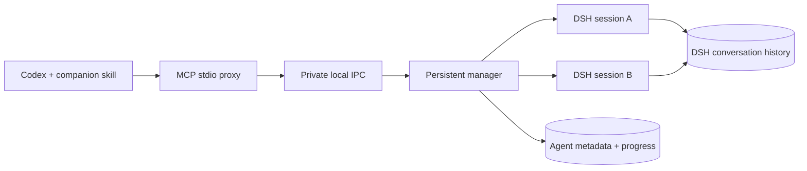

# Runtime and permissions

Each agent owns a DSH process and working directory. The bridge uses DSH's SDK JSON-RPC interface, plus a separate plugin exposing cancellation, checkpointing, and persisted-session resume. The plugin uses DSH's existing agent registry and cancellation mechanism.

The current local release candidate is delivered for Windows. Platform-specific
references below describe implementation behavior and do not claim Linux/macOS
release acceptance. DSH Desktop.exe is not integrated by this candidate.

Local IPC is a private Unix socket on Linux and macOS, or authenticated loopback
TCP on Windows. Native per-user services keep the manager available; a detached
background process is used when login services are unavailable. Installation,
configuration and task state follow each platform's user-directory conventions.

Disconnecting a client leaves work running. Restarting the daemon stops its processes and marks unfinished work interrupted. Execution resumes only after an explicit follow-up; the bridge does not replay an unfinished task automatically.

An accepted start/follow-up has a persisted execution ID. Completion registration uses this execution and the parent thread for deduplication; it does not treat reconnecting to a client as new work. A durable delivery attempt prevents automatic retransmission after acknowledgement loss. Reconnecting an observer only waits for the original execution. See [recovery](recovery.md) for status and operator actions.

Independent Codex workers record their model routing decision with their owned thread. Explicit simple tasks select Luna/medium; other new tasks select Sol/medium by default. New requests below medium are rejected before worker launch. DSH-to-Codex Astra requests return `ASTRA_DELEGATION_FORBIDDEN`; this does not control Codex's built-in subagents. See [model routing](model-routing.md).

## Operational boundaries

- A child does not inherit the Codex transcript. Include the relevant context, permitted actions, and acceptance criteria in its task.
- The bridge applies the requested permission preset after DSH creates the session, then refuses to run if DSH reports a different effective preset. Applying it earlier let a user default such as `danger-full-access` replace `workspace-write`.
- DSH's platform permission backend enforces `workspace-write` and `read-only`. On Linux, `workspace-write` confines file writes to `cwd` and gives the shell a private temporary directory; network access remains available.
- DSH permissions are independent of Codex permissions. Do not grant broader access than the parent task authorizes. Approval escalation has no human answerer in this bridge and fails closed.
- Interrupting does not undo files already changed. Check results against actual artifacts.
- Completion defaults to `auto`: CLI uses native delivery and Codex Desktop uses desktop-message. Desktop-message sends the saved result as an ordinary message to the same chat; failed registration falls back to one pending wait on the same agent. The CLI native callback and DSH task must use the same Codex App Server. Native CLI is a public experimental interface; the current Desktop native callback and a fresh CLI end-to-end callback journey are not claimed as passed. DSH Desktop.exe is not integrated. Delivery listeners do not poll with model calls; they preserve the full result and prevent automatic retries after uncertain delivery. Client request limits still apply even when `seconds` is omitted. Progress is queried through tools; large events are marked truncated.
- The daemon belongs to one operating-system user. Clients under that account share its agent inventory; its IPC endpoint is not exposed to the network.
- DSH is evolving. Re-run live tests after upgrading it; this version extends the exported SDK server class and uses the agent registry.
